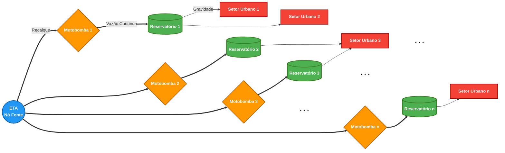

```mermaid
graph LR
    %% Classes de Estilo
    classDef eta fill:#2196F3,stroke:#0b5394,stroke-width:2px,color:#fff,font-weight:bold
    classDef bomba fill:#FF9800,stroke:#b45f06,stroke-width:2px,color:#fff,font-weight:bold
    classDef res fill:#4CAF50,stroke:#38761d,stroke-width:2px,color:#fff,font-weight:bold
    classDef setor fill:#f44336,stroke:#990000,stroke-width:2px,color:#fff,font-weight:bold
    classDef invisivel fill:transparent,stroke:transparent,color:#000,font-size:24px,font-weight:bold

    %% Nó Fonte
    ETA((ETA<br/>Nó Fonte)):::eta

    %% Coluna das Bombas
    B1{Motobomba 1}:::bomba
    B2{Motobomba 2}:::bomba
    B3{Motobomba 3}:::bomba
    Bdots(( . . . )):::invisivel
    Bn{Motobomba n}:::bomba

    %% Coluna dos Reservatórios
    R1[(Reservatório 1)]:::res
    R2[(Reservatório 2)]:::res
    R3[(Reservatório 3)]:::res
    Rdots(( . . . )):::invisivel
    Rn[(Reservatório n)]:::res

    %% Coluna das Demandas
    D1[Setor Urbano 1]:::setor
    D2[Setor Urbano 2]:::setor
    D3[Setor Urbano 3]:::setor
    Ddots(( . . . )):::invisivel
    Dn[Setor Urbano n]:::setor

    %% Conexões de Recalque
    ETA ==>|Recalque| B1
    ETA ==> B2
    ETA ==> B3
    ETA ==> Bn

    %% Conexões para os Reservatórios
    B1 ==>|Vazão Contínua| R1
    B2 ==> R2
    B3 ==> R3
    Bn ==> Rn

    %% Conexões de Gravidade (Interligações)
    R1 -->|Gravidade| D1
    R1 --> D2
    
    R2 --> D3
    R3 --> D3
    
    Rn --> Dn

    %% Links invisíveis para forçar o alinhamento vertical das colunas
    B1 ~~~ B2 ~~~ B3 ~~~ Bdots ~~~ Bn
    R1 ~~~ R2 ~~~ R3 ~~~ Rdots ~~~ Rn
    D1 ~~~ D2 ~~~ D3 ~~~ Ddots ~~~ Dn
```