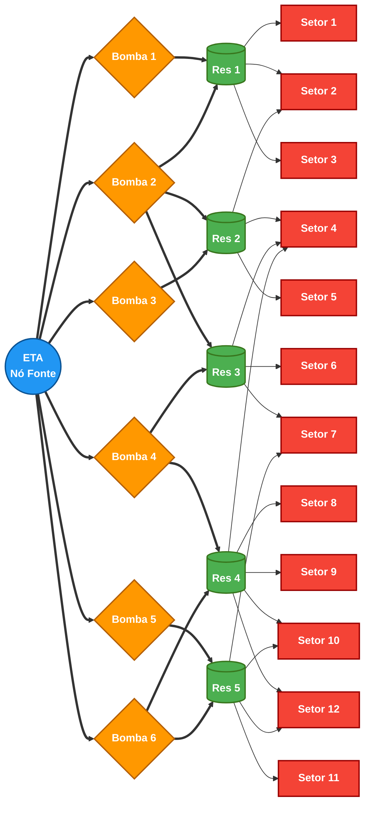

```mermaid
graph LR
    %% Classes de Estilo
    classDef eta fill:#2196F3,stroke:#0b5394,stroke-width:2px,color:#fff,font-weight:bold
    classDef bomba fill:#FF9800,stroke:#b45f06,stroke-width:2px,color:#fff,font-weight:bold
    classDef res fill:#4CAF50,stroke:#38761d,stroke-width:2px,color:#fff,font-weight:bold
    classDef setor fill:#f44336,stroke:#990000,stroke-width:2px,color:#fff,font-weight:bold

    %% Nó Fonte
    ETA((ETA<br/>Nó Fonte)):::eta

    %% Bombas (6)
    B1{Bomba 1}:::bomba
    B2{Bomba 2}:::bomba
    B3{Bomba 3}:::bomba
    B4{Bomba 4}:::bomba
    B5{Bomba 5}:::bomba
    B6{Bomba 6}:::bomba

    %% Reservatórios (5)
    R1[(Res 1)]:::res
    R2[(Res 2)]:::res
    R3[(Res 3)]:::res
    R4[(Res 4)]:::res
    R5[(Res 5)]:::res

    %% Setores de Consumo (12)
    S1[Setor 1]:::setor
    S2[Setor 2]:::setor
    S3[Setor 3]:::setor
    S4[Setor 4]:::setor
    S5[Setor 5]:::setor
    S6[Setor 6]:::setor
    S7[Setor 7]:::setor
    S8[Setor 8]:::setor
    S9[Setor 9]:::setor
    S10[Setor 10]:::setor
    S11[Setor 11]:::setor
    S12[Setor 12]:::setor

    %% ETA alimenta todas as bombas
    ETA ==> B1
    ETA ==> B2
    ETA ==> B3
    ETA ==> B4
    ETA ==> B5
    ETA ==> B6

    %% Recalque assimétrico: Bombas para Reservatórios
    B1 ==> R1
    B2 ==> R1
    B2 ==> R2
    B2 ==> R3
    B3 ==> R2
    B4 ==> R3
    B4 ==> R4
    B5 ==> R5
    B6 ==> R4
    B6 ==> R5

    %% Distribuição assimétrica: Reservatórios para Setores
    R1 --> S1
    R1 --> S2
    R1 --> S3
    
    R2 --> S2
    R2 --> S4
    R2 --> S5
    
    R3 --> S4
    R3 --> S6
    R3 --> S7
    
    R4 --> S4
    R4 --> S8
    R4 --> S9
    R4 --> S10
    R4 --> S12
    
    R5 --> S7
    R5 --> S10
    R5 --> S11
    R5 --> S12
```